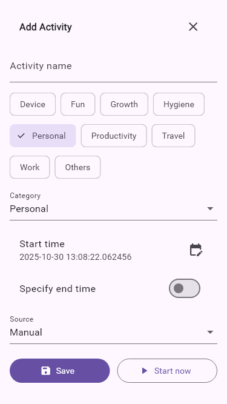
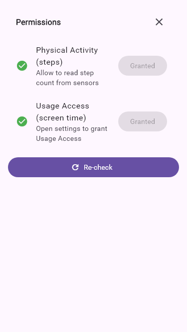

# dgHabit

MSc IT Semester-3 Project — Daily Event Logger App using Flutter

Build habits, day by day — log activities, visualize trends, and grow.

## Overview

- Flutter (Material 3), Riverpod, Firebase (Auth/Firestore)
- Daily timeline with continuity handling (no-gap/overlap strategies)
- Bottom-sheet UI for Add/Edit Activity, Settings, Permissions, and Category Manager
- Analytics with weekly trends and category breakdowns
- New: Meals category with photo upload and nutrition fields (calories, health score)
- New: Local notifications for inactivity reminders and screen time checks

## Screenshots

Composite: `docs/screenshots/all_screens.png`

Key screens (see more under `docs/screenshots/individual/`):








## Development

1) Install Flutter and set up platforms.
2) Configure Firebase (google-services.json / GoogleService-Info.plist).
3) Run:

```powershell
flutter pub get
flutter run
```

## Generate documentation screenshots

```powershell
flutter test --update-goldens test/screenshots/golden_screens_test.dart
```

Outputs are written to `docs/screenshots/` and `docs/screenshots/individual/`.

## Design System

- **Colors**:
  - AppBar background: 0xFF2DD4BF (mint green)
  - AppBar foreground: White
  - Schemes: Material 3 dynamic (light/dark)

- **Typography**:
  - Sheet headers: TitleMedium, fontWeight: w700
  - Body text: Default Material 3

- **Components**:
  - Sheet headers: Padding 16h 4v, title + actions (close/save/delete)
  - Buttons: FilledButton (primary), OutlinedButton (secondary)
  - Lists: ListTile with dense/visualDensity compact

## License

MIT (update if different)
