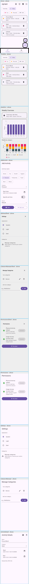

# dgHabit

MSc IT Semester-3 Project — **Daily Habit & Event Logger** built with Flutter.

Build habits, day by day — log activities, visualize trends, and grow.

---

## ✨ Features

- 📱 **Flutter (Material 3)** UI with responsive layouts
- 🔐 **Firebase Auth** (email / password)
- ☁️ **Cloud Firestore** for storing activities and configuration
- 📊 **Analytics dashboard**
  - Weekly trends
  - Category-wise breakdown
- 📆 **Daily timeline** with continuity handling
  - No gaps / overlap strategies
  - Easy editing of past activities
- ➕ **Bottom-sheet based UI** for:
  - Add / Edit Activity
  - Settings
  - Permissions
  - Category Manager
- 🥗 **Meals category**
  - Photo upload
  - Nutrition fields (calories, health score)
- 🔔 **Local notifications**
  - Inactivity reminders
  - Screen-time checks

---

## 🖼 Screenshots

Composite (all screens):



Key individual screens (under `docs/screenshots/individual/`):

- **Splash / Dashboard**
  - 
- **Authentication**
  - 
  - 
- **Home / Timeline / Overview**
  - 
  - 
  - 
  - 
- **Activities & Details**
  - 
  - 
  - 
- **Categories & Settings**
  - 
  - 
  - 
  - 

All images referenced above exist under `docs/screenshots/` in this repository, so GitHub will render them correctly.

---

## 🛠 Tech Stack

- **Framework**: Flutter (Material 3)
- **State Management**: Riverpod
- **Backend**: Firebase Auth, Cloud Firestore, Firebase Storage
- **Platforms**: Android, iOS, Web, Desktop (where supported by Flutter)

---

## 🚀 Getting Started

1. **Clone the repo**
   ```powershell
   git clone https://github.com/rajkumartetar/dgHabit.git
   cd dgHabit
   ```

2. **Install Flutter dependencies**
   ```powershell
   flutter pub get
   ```

3. **Configure Firebase**
   - Add `google-services.json` to `android/app/` (Android)
   - Add `GoogleService-Info.plist` to `ios/Runner/` (iOS)
   - Ensure web Firebase configuration is set up if building for web.

4. **Run the app**
   ```powershell
   flutter run
   ```

---

## 🧪 Tests & Screenshot Generation

To run tests:

```powershell
flutter test
```

To regenerate documentation screenshots (goldens):

```powershell
flutter test --update-goldens test/generate_screenshots_test.dart
```

Generated outputs are written to:

- `docs/screenshots/`
- `docs/screenshots/individual/`

---

## 🎨 Design System

- **Colors**
  - Mint primary (e.g. `0xFF2DD4BF`) for highlights and AppBar
  - Light & dark themes using Material 3 color schemes
- **Typography**
  - Sheet headers: `TitleMedium`, `fontWeight: w700`
  - Body text: default Material 3 typography
- **Components**
  - Bottom sheets with padded headers and primary/secondary actions
  - `FilledButton` (primary), `OutlinedButton` (secondary)
  - Compact `ListTile` usage for dense lists

---

## 📄 License

This project is licensed under the **MIT License** (update this section if the actual license differs).
