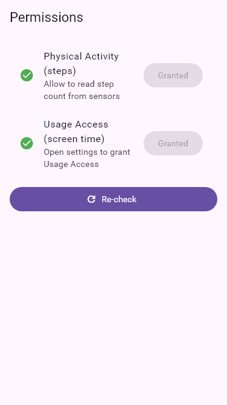

# dgHabit – Academic Documentation (TOC-aligned)

Title: dgHabit – A Minimal, Sheet‑Based Habit and Activity Tracker

Author(s): [Your Name]

Affiliation: [Institute / Department]

Date: November 5, 2025

---

## Table of Contents

| Sr. No. | Chapter Title                          | Page no |
|---------|----------------------------------------|---------|
|         | CHAPTER 1: INTRODUCTION                | 7       |
| 1.1     | Problem Statement                      | 8       |
| 1.2     | Project Scope                          | 8       |
| 1.3     | Purpose                                 | 8       |
|         | CHAPTER 2: REQUIREMENTS AND ANALYSIS   | 9       |
| 2.1     | System Analysis                         | 10      |
| 2.2     | Software and Hardware Requirements     | 10      |
|         | CHAPTER 3: PROJECT PLANNING AND SCHEDULING | 13   |
|         | CHAPTER 4: SYSTEM DESIGN               | 15      |
| 4.1     | Logical Design                          | 16      |
| 4.1.1   | Data Flow Diagram (DFD)                 | 16      |
| 4.1.2   | ER Diagram                              | 17      |
| 4.1.3   | Module Design                           | 18      |
| 4.1.4   | Data Dictionary                         | 18      |
|         | CHAPTER 5: SCREEN LAYOUT AND TESTING   | 20      |
| 5.1     | Screen Layout                           | 21      |
|         | CHAPTER 6: FUTURE SCOPE AND ENHANCEMENT | 33      |
|         | CHAPTER 7: CONCLUSION AND LIMITATIONS   | 35      |
|         | CHAPTER 8: BIBLIOGRAPHY                 | 37      |

> Note: Page numbers reflect the requested format for academic submission. Actual pagination will depend on export settings (DOCX/PDF).

---

## CHAPTER 1: INTRODUCTION

dgHabit is a cross‑platform Flutter application that helps users build habits through a daily timeline of activities, lightweight automation (steps, screen time), and clear analytics. The app uses a persistent shell and presents feature UIs as modal bottom sheets for a focused, modern experience.

### 1.1 Problem Statement

Users often track habits in siloed tools (steps counters, task lists, screen‑time dashboards) that don’t present a holistic, continuous picture of a day. Without continuity, trend visibility, and gentle automation, it’s hard to measure and improve routines.

### 1.2 Project Scope

- Platforms: Android, iOS, Web, Windows, macOS, Linux (Flutter)
- Core features: activity timeline, categories, analytics, steps and screen‑time integration, camera photo for meals, local/background notifications (Android)
- Data: Firebase Auth for user identity, Firestore for per‑user activity storage
- Out of scope: social features, complex goals/rewards, iOS screen‑time APIs (not available)

### 1.3 Purpose

Provide a unified, minimal tool to log activities, maintain a continuous timeline, and visualize weekly insights—reducing friction and enabling gradual habit improvement.

---

## CHAPTER 2: REQUIREMENTS AND ANALYSIS

### 2.1 System Analysis

- Stakeholders: individual users seeking personal productivity and wellness insights
- Use‑cases:
  - Log/edit activities (with continuity handling for overlaps/gaps)
  - View today’s and weekly analytics (category split, top apps, steps)
  - Manage categories (create/rename/delete and reassign activities)
  - Manage permissions (Physical Activity, Usage Access, Camera, Notifications)
  - Set per‑app screen‑time limits with background alerts (Android)

- Feasibility:
  - Technical: Flutter + Firebase provide cross‑platform UI and cloud storage; Android Usage Access allows per‑app screen‑time; local notifications available on both platforms (with differences)
  - Operational: Simple onboarding, compact screens via sheets, offline‑tolerant UI (Firestore sync)
  - Economic: Free tier Firebase for development; no paid dependencies required
  - Current release note: The third‑party Usage Stats plugin was replaced with a local stub to resolve Android release build issues (AAPT lStar and stale registrant). As a result, per‑app screen‑time analytics and background per‑app limits gracefully show “No data” until a native channel implementation is added.

### 2.2 Software and Hardware Requirements

- Software:
  - Flutter SDK (3.x+), Dart SDK
  - Android Studio (Android SDK) and/or Xcode (macOS) for device builds
  - Firebase project with `google-services.json` / `GoogleService-Info.plist`
  - Recommended IDE: VS Code or Android Studio

- Hardware:
  - Development machine with 8GB+ RAM
  - Android device/emulator; iOS device/simulator (macOS)
  - Camera and step sensor for respective features on devices

---

## CHAPTER 3: PROJECT PLANNING AND SCHEDULING

Phased plan and outcomes:

1) Foundations: modern UI shell, theme, sheet components, deterministic testing
2) Core features: activities CRUD, continuity helpers, analytics
3) Integrations: steps via Activity Recognition, screen‑time via Usage Access (Android)
4) Meals: camera/gallery photo upload to Firebase Storage; in‑app crop and remove
5) Notifications: local notifications; background WorkManager checks for per‑app limits (Android)
6) Product polish: quick actions simplified, permissions sheet refined (Camera first), analytics split (Today/Weekly), developer/testing UI removed
7) Release hardening: fix Android compile/target SDK (35), pin build tools, remove stale registrant; replace deprecated usage stats plugin with a local stub to unblock release; adjust splash assets for correct appearance

Deliverables: working app, test suite (including goldens), documentation and screenshots.

---

## CHAPTER 4: SYSTEM DESIGN

Architecture overview:

- UI: Flutter Material 3; persistent shell (AppBar + Bottom Nav); features as modal bottom sheets
- State: Riverpod providers for services and preferences
- Data: Firebase Auth/Firestore under `users/{uid}`
- Services:
  - FirebaseService: activity CRUD, overlap/gap continuity helpers
  - Sensor/usage: steps (Activity Recognition). For per‑app screen‑time, the current release ships a local stub; a native UsageStatsManager channel will restore analytics in a future version.
  - Background: WorkManager scheduler (Android), local notifications

### 4.1 Logical Design

#### 4.1.1 Data Flow Diagram (DFD) – textual view

- External Entity: User
- Processes: Log Activity, Edit Activity, View Timeline, View Analytics, Manage Categories, Background Screen‑time Check
- Data Stores: Firestore (Activities, Preferences)
- Flows:
  - User → Log/Edit → Activities Store → Timeline/Analytics
  - Background Check → Preferences → Notifications → User

#### 4.1.2 ER Diagram – textual view

Entities and relationships:

- User(uid) 1..1 — owns — 0..N Activity(activityId)
- User(uid) 1..1 — owns — 0..1 NotificationPrefs(backgroundScreenChecks, perAppLimits)
- Activity has: name, startTime, endTime, category, source, steps?, screenTimeMinutes?, mealPhotoUrl?
- NotificationPrefs has perAppLimits: Map<packageName, minutes>

#### 4.1.3 Module Design

- Authentication: Firebase Auth
- Timeline & Activities: home, timeline, add/edit activity, activity detail
- Analytics: today analytics, weekly overview
- Categories: category manager (add/rename/delete, reassign)
- Settings & Permissions: preferences UI, permission guidance
- Background & Notifications: WorkManager tasks, local notifications
- Storage: Firebase Storage for meal photos (upload, delete). Image editing (pick/crop/remove) is provided within the Meals section of Activity Detail.

#### 4.1.4 Data Dictionary

- Collection: `users/{uid}/activities`
  - activityId: string (doc id)
  - activityName: string
  - startTime: timestamp
  - endTime: timestamp
  - category: string
  - source: string enum(manual|auto)
  - steps: int? (optional)
  - screenTimeMinutes: double? (optional)
  - mealPhotoUrl: string? (optional)

- Document: `users/{uid}/preferences`
  - backgroundScreenChecks: bool
  - perAppLimits: map<string packageName, int minutes>

---

## CHAPTER 5: SCREEN LAYOUT AND TESTING

### 5.1 Screen Layout (selected)

All screenshots are generated automatically and stored under `docs/screenshots/individual/`.

- Splash: 
- Onboarding: 
- Home: 
- Timeline: 
- Analytics: 
- Add Activity: 
- Activity Detail: 
  - Includes a Meals editor with: camera/gallery pick, in‑app crop, remove, and optional fields for calories and health score. Images are stored in Firebase Storage and can be cleared from the same sheet.
- Settings: 
- Category Manager: 
- Permissions (Camera first): 
- Quick Actions (only steps): 

Testing approach:

- Golden tests (golden_toolkit) produce deterministic screenshots
- Unit tests validate continuity helpers and service behaviors
- Analyzer/lints: code quality and deprecation checks

---

## CHAPTER 6: FUTURE SCOPE AND ENHANCEMENT

- Dark mode goldens and responsive tablet/desktop layouts
- Friendlier per‑app names/icons in Settings for limits
- Replace usage stats stub with a native Android UsageStatsManager platform channel (query usage/events) to restore per‑app analytics and background per‑app limits in release builds
- Upload progress indicators for meal photos and better offline handling (queued sync)
- iOS parity for screen‑time‑like guidance (platform permitting)
- Additional automations: calendar import, location suggestions
- Reminders, streaks, and goal tracking; richer analytics

---

## CHAPTER 7: CONCLUSION AND LIMITATIONS

dgHabit demonstrates a focused, sheet‑based UX that keeps daily logging fast, accurate, and visually consistent. Continuity helpers prevent broken timelines and analytics summarize weekly progress. Limitations include platform differences for screen‑time on iOS, dependence on user‑granted permissions, and (in this release) a temporary local stub for Android Usage Stats that disables per‑app screen‑time analytics and per‑app background limits. A native channel will restore these capabilities.

---

## CHAPTER 8: BIBLIOGRAPHY

1. Flutter Documentation – https://docs.flutter.dev
2. Riverpod – https://riverpod.dev
3. Firebase (Auth/Firestore/Storage) – https://firebase.google.com/docs
4. Material Design 3 – https://m3.material.io
5. Android Usage Stats / App Usage Access – Android Developers
6. golden_toolkit – https://pub.dev/packages/golden_toolkit
7. workmanager – https://pub.dev/packages/workmanager
8. permission_handler, pedometer – pub.dev packages
9. image_picker – https://pub.dev/packages/image_picker
10. crop_your_image – https://pub.dev/packages/crop_your_image
11. Firebase Storage – https://firebase.google.com/docs/storage

---

### Appendix A: How to Run (Developer)

```powershell
flutter pub get
flutter run
```

Build for release (Android):

```powershell
# Optional cleanup
flutter clean; flutter pub get

# Build APK (minSdk 23, compile/target SDK 35)
flutter build apk --release
```

Configure Firebase with:

- Android: `android/app/google-services.json`
- iOS: `ios/Runner/GoogleService-Info.plist`

### Appendix B: Export to DOCX/PDF

You can export this Markdown to DOCX/PDF using Pandoc:

```powershell
# DOCX
pandoc -s docs/Academic_Documentation_TOC.md -o docs/Academic_Documentation_TOC.docx

# PDF (requires TeX, e.g., MiKTeX)
pandoc -s docs/Academic_Documentation_TOC.md -o docs/Academic_Documentation_TOC.pdf --pdf-engine=xelatex
```
