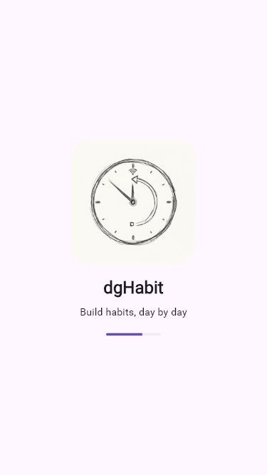
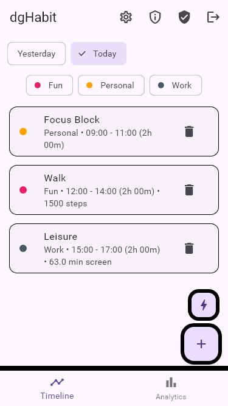
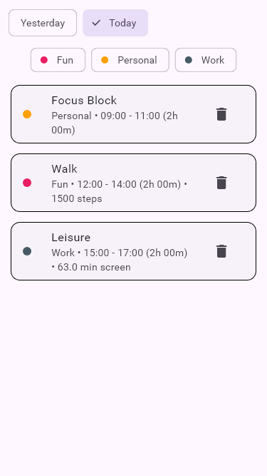
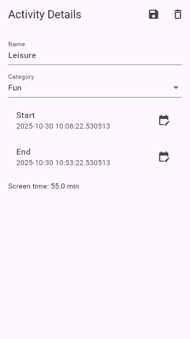
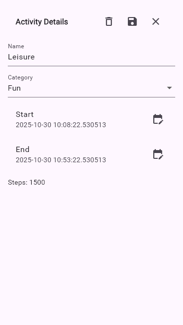
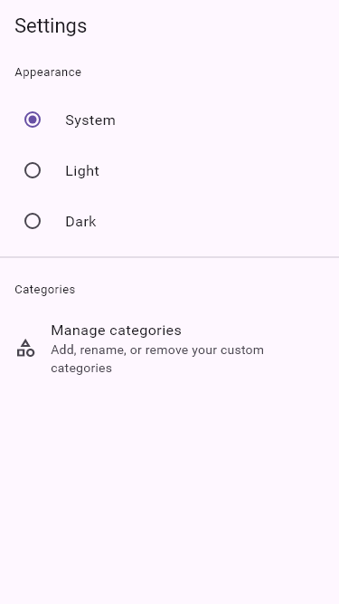
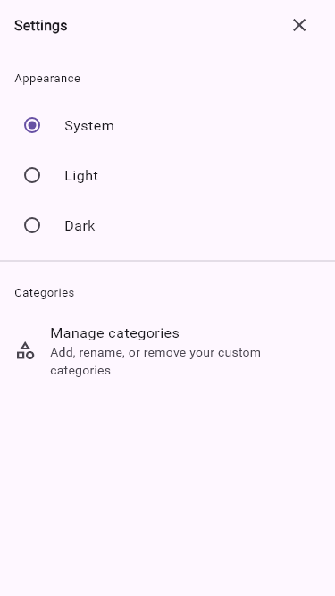
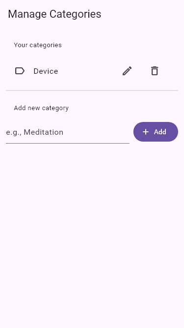
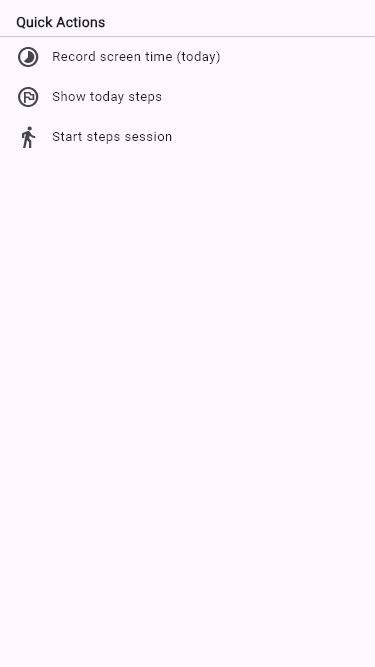

# dgHabit Documentation

This document outlines the current dgHabit product, architecture, and UI walkthrough using up-to-date screenshots from `docs/screenshots/individual/`.

## 1. Overview
- App name: dgHabit
- One-liner: Build habits, day by day — log activities, visualize trends, and grow.
- Platforms: Android, iOS, Web, Windows, macOS, Linux (Flutter)
- Tech stack: Flutter (Material 3), Riverpod, Firebase (Auth/Firestore), Syncfusion Charts, fl_chart, Lottie, flutter_svg.

## 2. Problem & Solution
- Problem: Fragmented habit tracking across steps, screen time, and manual logs; difficult to see trends.
- Solution: Unified daily timeline with continuous activities, category insights, and lightweight automation (steps, screen time).

## 3. Key Features
- Minimal onboarding with skip/next.
- Unified AppBar color and a persistent shell (AppBar + Bottom Nav) for a stable frame.
- Feature UIs are presented as modal bottom sheets for a “fragment-like” experience:
  - Add Activity, Activity Detail, Settings, Permissions, Category Manager.
- Daily timeline with continuous activities (gap/overlap handling to maintain continuity).
- Add/edit activities with default and custom categories; quick-start flow.
- Analytics: weekly trends, category breakdowns, and top insights.
- Settings: theme mode, category management; Permissions: activity/usage access.
- Quick Actions sheet: screen time capture, show today steps, start/stop steps session.
- Firebase-backed: Auth + Firestore for persistence (mocked in tests for screenshots).

## 4. App Walkthrough
Screenshots are generated automatically via golden tests. See section 9.

### 4.1 Splash


### 4.2 Onboarding


### 4.3 Home


### 4.4 Timeline


### 4.5 Analytics


### 4.6 Add Activity


Sheet variant:


### 4.7 Activity Detail


Sheet variant:



### 4.8 Settings


Sheet variant:



### 4.9 Category Manager


Sheet variant:


### 4.10 Permissions
Full page:


Sheet variant:


### 4.11 Quick Actions (Sheet)



## 5. Data Model
```text
ActivityModel
- activityId: string
- activityName: string
- startTime: Date
- endTime: Date
- category: string
- source: enum(manual|auto)
- steps?: int
- screenTimeMinutes?: double
```

## 6. Architecture
- State: Riverpod providers (e.g., `firebaseServiceProvider`, `sensorServiceProvider`).
- Services: `FirebaseService` wraps Auth/Firestore; overlap/gap continuity helpers for activities.
- UI: Material 3; unified AppBar theming; feature screens presented as modal sheets with compact sheet headers.

## 7. Firebase & Permissions
- Firebase: Auth (email/google), Firestore collections under `users/{uid}`.
- Android permissions:
  - Physical Activity (Activity Recognition) to read steps sensors.
  - Usage Access to read screen time per app; the app guides users to grant this.

## 8. How to Run
- Prereqs: Flutter SDK, Firebase project configured (google-services.json/GoogleService-Info.plist).
- Run: `flutter pub get` then `flutter run`.

## 9. Testing & Screenshots
- Golden tests generate the documentation screenshots with mock data and a fake Firebase service:
  - Run: `flutter test --update-goldens test/screenshots/golden_screens_test.dart`
- Output paths:
  - Composite: `docs/screenshots/all_screens.png`
  - Individuals: `docs/screenshots/individual/*.png`

## 10. Roadmap
- Dark mode goldens
- Tablet/desktop layout polish
- More automation sources (calendar, location)
- Reminders & streaks

## 11. Credits & License
- Icons/illustrations: in `assets/brand/`
- Libraries: see `pubspec.yaml`
- License: MIT (adjust if different)
